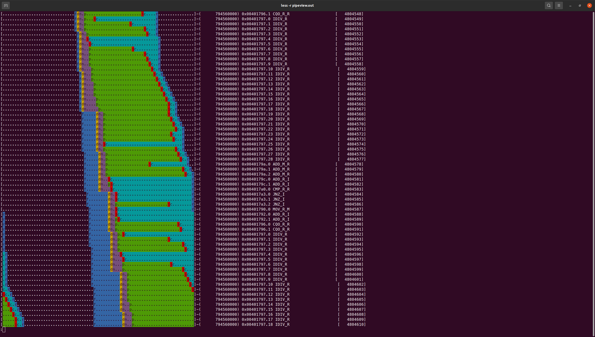

# 现代计算机体系架构第二次课程实验

## *——超标量处理器性能和Cache架构仿真*


## 1. 搭建实验环境 

### 1.1 测试程序编译

使用如下命令将`iaxpy.cpp`编译为可执行文件。

```
g++ iaxpy.cpp util/m5/src/abi/x86/m5op.S -o daxpy-gem5 --static --std=gnu++0x -O2 -I ./include/
```

### 1.2 仿真环境搭建

 先在`build_opts/X86`中的`CPU_MODELS`后加入`MinorCPU`选项，再执行`scons build/X86/gem5.opt`，可搭建x86下的仿真环境。

执行`build/X86/gem5.opt configs/example/se.py --cmd=daxpy-gem5`测试之前得到的可执行文件，结果如下所示。

```
**** REAL SIMULATION ****
info: Entering event queue @ 0.  Starting simulation...
info: Increasing stack size by one page.
warn: ignoring syscall mprotect(...)
info: Increasing stack size by one page.
info: Increasing stack size by one page.
info: Increasing stack size by one page.
info: Increasing stack size by one page.
info: Increasing stack size by one page.
info: Increasing stack size by one page.
info: Increasing stack size by one page.
info: Increasing stack size by one page.
info: Increasing stack size by one page.
info: Increasing stack size by one page.
info: Increasing stack size by one page.
info: Increasing stack size by one page.
info: Increasing stack size by one page.
info: Increasing stack size by one page.
info: Increasing stack size by one page.
info: Increasing stack size by one page.
info: Increasing stack size by one page.
info: Increasing stack size by one page.
info: Increasing stack size by one page.
info: Increasing stack size by one page.
512319
Exiting @ tick 2342414000 because exiting with last active thread context
```

同时，`m5out/stats.txt`中有三段`---------- Begin Simulation Statistics ----------`，分别标志代码中各个`m5_dump_reset_stats()`时dump（或者结尾`exit()`）的先前统计结果。


## 2. 关于处理器性能的问题

### 2.1 设置仿真脚本

将python仿真脚本放入到`configs`目录下。默认配置信息如下。

- 默认O3 CPU的commit width为8（`src/cpu/o3/O3CPU.py`中`commitWidth = Param.Unsigned(8, "Commit width")`）

- 默认ROB（reorder buffer）有192个entry（`src/cpu/o3/O3CPU.py`中`numROBEntries = Param.Unsigned(192, "Number of reorder buffer entries")`），

  但需要注意的是，`common`中的配置将ROB的entry数量改为了512（`configs/common/CpuConfig.py`中`cpu.numROBEntries = 512;`）

- 默认的L1 Cache的大小

  `hw2`的配置中，L1 Instruction Cache大小16kB，L1 Data Cache大小64kB（`configs/hw2/caches.py`中`size = '16kB'`和`size = '64kB'`）

  而`common`配置中，L1 Instruction Cache大小32kB，L1 Data Cache大小64kB（`configs/common/Options.py`中`parser.add_option("--l1d_size", type="string", default="64kB")`和`parser.add_option("--l1i_size", type="string", default="32kB")`）

- 默认的L1 Cache映射和替换策略

  映射是2路组相连（`configs/hw2/caches.py`中`assoc = 2`和`configs/common/Options.py`中`parser.add_option("--l1d_assoc", type="int", default=2)`和`parser.add_option("--l1i_assoc", type="int", default=2)`）

  替换策略`hw2`的配置中是MRU（Most Recently Used，`configs/hw2/caches.py`中`replacement_policy = MRURP()`），`common`继承了默认配置为LRU（Least Recently Used，`src/mem/cache/Cache.py`中`replacement_policy = Param.BaseReplacementPolicy(LRURP(), "Replacement policy")`）

- 默认的除法单元（`hw2`配置）的操作延时是1个周期（`configs/hw2/cpu.py`中`options.add_option('--alu-div-operation-latency', type=int, default=1, help="Latency of integer divide operations. Default is 1")`）

  而在默认全局的配置（被`common`配置所继承，但被`hw2`配置覆盖）中，Minor CPU中除法单元操作延时是9个周期（`src/cpu/minor/MinorCPU.py`中`MinorDefaultIntDivFU`有`opLat = 9`），而O3 CPU中除法单元延时是20个周期（`src/cpu/o3/FuncUnitConfig.py`中`OpDesc(opClass='IntDiv', opLat=20, pipelined=False)`

- 默认的整数ALU单元的延时，O3 CPU是1个周期（`hw2`和`common`配置中未显式指定，是继承自`src/cpu/o3/FuncUnitConfig.py`中`IntALU`类，但没有指定`opLat`，因此使用的是`src/cpu/FuncUnit.py`中`OpDesc`类的默认参数`opLat = Param.Cycles(1, "cycles until result is available")`），而Minor CPU是3个周期（同上未显式指定，继承自`src/cpu/minor/MinorCPU.py`中`MinorDefaultIntFU`，其中`opLat = 3`）

- 默认的ALU （add/sub）和整数乘除（mul/div）的运算单元数量在`hw2`配置中分别为4个和1个（`configs/hw2/cpu.py`中`options.add_option('--alu-units', type=int, default=4, help="Number of integer ALUs units. Default is 4")`和`options.add_option('--int-div-units', type=int, default=1, help="Number of integer div ALUs units. Default is 1")`）

  而在默认全局的配置（被`common`配置所继承，但被`hw2`配置覆盖）中，Minor CPU中ALU有2个，整数乘除运算单元2个（`src/cpu/minor/MinorCPU.py`中`MinorDefaultFUPool`有`MinorDefaultIntFU`实例两个，`MinorDefaultIntMulFU`一个与`MinorDefaultIntDivFU`一个），而O3 CPU中ALU有6个，整数乘除运算单元2个（`src/cpu/o3/FuncUnitConfig.py`中`IntALU`类中`count = 6`和`IntMultDiv`类中`count = 2`）

### 2.2 `daxpy-gem5`的汇编代码

以`objdump -S daxpy-gem5`指令，可以查看`daxpy-gem5`可执行文件的汇编代码（可以在编译时加入`-g`选项保留代码文字信息方便查找）。

查找`m5_dump_reset_stats`函数的调用可以找到感兴趣区域中的汇编指令。若不考虑`m5_dump_reset_stats()`的调用（每次三条指令，两个`xor`和一个`callq`），则有效代码是从`401784`地址的`mov %r12,%rcx`开始，到`4017a3`地址的`jne 401790 <main+0x120>`结束，其中指令共10条（包含一个用于对齐的空指令）。

```assembly
401778:	31 f6                	xor    %esi,%esi
40177a:	31 ff                	xor    %edi,%edi
40177c:	4c 89 e5             	mov    %r12,%rbp
40177f:	e8 d4 08 00 00       	callq  402058 <m5_dump_reset_stats>
401784:	4c 89 e1             	mov    %r12,%rcx
401787:	66 0f 1f 84 00 00 00 	nopw   0x0(%rax,%rax,1)
40178e:	00 00 
401790:	8b 03                	mov    (%rbx),%eax
401792:	48 83 c3 04          	add    $0x4,%rbx
401796:	99                   	cltd   
401797:	41 f7 fd             	idiv   %r13d
40179a:	01 01                	add    %eax,(%rcx)
40179c:	48 83 c1 04          	add    $0x4,%rcx
4017a0:	4c 39 e3             	cmp    %r12,%rbx
4017a3:	75 eb                	jne    401790 <main+0x120>
4017a5:	31 f6                	xor    %esi,%esi
4017a7:	31 ff                	xor    %edi,%edi
4017a9:	48 81 c3 40 9c 00 00 	add    $0x9c40,%rbx
4017b0:	e8 a3 08 00 00       	callq  402058 <m5_dump_reset_stats>
```

除计算之外的额外指令包括以下指令：

- `mov %r12,%rcx`（用以规定`for`循环的范围，`%rcx`寄存器存储`Y[i]`地址，与此同时`%rbx`存储`X[i]`地址）
- `nopw 0x0(%rax,%rax,1)`（空指令，用于对齐机器码，实际不执行）
- `mov (%rbx),%eax`（将`X[i]`载入`%eax`寄存器）
- `cltd`（将`%eax`扩展到`%edx:%eax`）
- `jne 401790 <main+0x120>`（分支跳转，考察`for`循环的范围）

 默认参数下，理论IPC最大可以达到接近8，因为一个循环周期内8条指令，资源恰4个整型计算单元和1个整型除法单元，当将各指令流水线式地分配在各单元上，则平均每个循环一个周期，执行了8条指令，IPC可接近8。然而实际上，x86指令集需要把每条指令解码成微指令，因此实际微指令数每个循环远大于8条，占用更多资源，理论IPC上界远低于8。

### 2.3 `daxpy-gem5`仿真

#### IPC分析

分别执行`build/X86/gem5.opt configs/hw2/run.py minor`和`build/X86/gem5.opt configs/hw2/run.py o3`采用`run.py`进行`daxpy-gem5`的仿真。

Minor CPU的IPC是0.177599，而O3 CPU的IPC是0.491447。这个数目远低于先前的估计，具体分析如下：

- 首先由`system.cpu.iq.FU_type_0::total`可见，总共实际有430085条指令被issue，因此平均每个循环应为43个微指令，具体查看各个FU的类型，实际平均每个循环应是32个整型微指令，7个整型除法微指令，2个load和两个store。因此对于整型ALU，实际就需要平均每个循环至少8个周期，从而理论IPC上界至多为1。

- 进行可视化操作如下，发现在每个循环中，如`mov`、`add`指令都能在decode和rename后立刻issue，但`cltd`指令（图中`CQO_R_R`）虽然只依赖于`mov`指令，但实际执行中并不能立刻issue，似乎是存在某种依赖关系。

  ```bash
  build/X86/gem5.opt --debug-flags=O3PipeView --debug-start=794510500 --debug-end=875911000 --debug-file=trace.out configs/hw2/run.py o3
  ./util/o3-pipeview.py -c 500 -o pipeview.out --color m5out/trace.out
  less -r pipeview.out
  ```

  
  
- 进行详细的调试，在`debug-flags`中加入多个感兴趣的stage，观察每一条指令的运行情况。

  `build/X86/gem5.opt --debug-flags=Fetch,Decode,Rename,IEW,Commit,ROB,O3CPU --debug-start=794510500 --debug-file=debug.log configs/hw2/run.py o3`

  主要观察`cltd`指令的执行情况。以任一条`cltd`指令为例（下述4807772号微指令），查找4807772，向后找到其在`iew`中开始执行的时刻，同时找到其访问的物理寄存器（179和104号），再向前找到int register 179的上一次被写入是上一个时钟周期（tick小500，104号寄存器写入时间较早，不是瓶颈所在），是4807753号微指令，发现是上一个循环中的`idiv`指令中的某个微指令，也写入`%edx`寄存器。具体调试文件中与之相关的部分粘贴如下。

  ```
  ...
  795163000: system.cpu.fetch: [tid:0] Instruction PC 0x401797 (22) created [sn:4807753].
  795163000: system.cpu.fetch: [tid:0] Instruction is:   IDIV_R : mov   edx, edx, t6d
  ...
  795167000: system.cpu.fetch: [tid:0] Instruction PC 0x401796 (0) created [sn:4807772].
  795167000: system.cpu.fetch: [tid:0] Instruction is:   CQO_R_R : mov   edx, edx, eax
  795167000: system.cpu.fetch: [tid:0] Fetch queue entry created (29/32).
  795167000: system.cpu.fetch: [tid:0] Instruction PC 0x401796 (1) created [sn:4807773].
  795167000: system.cpu.fetch: [tid:0] Instruction is:   CQO_R_R : srai   edx, edx, 0x1f
  795167000: system.cpu.fetch: [tid:0] Fetch queue entry created (30/32).
  ...
  795188500: system.cpu.iew: Execute: Processing PC (0x401797=>0x40179a).(22=>23), [tid:0] [sn:4807753].
  795188500: global: RegFile: Access to int register 245, has data 0
  795188500: global: RegFile: Access to int register 233, has data 0x27
  795188500: global: RegFile: Access to int register 245, has data 0
  795188500: global: RegFile: Access to cc register 1267, has data 0
  795188500: global: RegFile: Access to cc register 1045, has data 0
  795188500: global: RegFile: Access to cc register 2, has data 0
  795188500: global: RegFile: Access to cc register 924, has data 0
  795188500: global: RegFile: Access to cc register 700, has data 0x20
  795188500: global: RegFile: Setting int register 179 to 0x27
  ...
  795189000: system.cpu.iew: Execute: Processing PC (0x401796=>0x401797).(0=>1), [tid:0] [sn:4807772].
  795189000: global: RegFile: Access to int register 179, has data 0x27
  795189000: global: RegFile: Access to int register 104, has data 0x3c
  795189000: global: RegFile: Access to int register 179, has data 0x27
  795189000: global: RegFile: Setting int register 121 to 0x3c
  ```

  查阅x86的文档发现，`idiv`指令是将`%edx:%eax`中的数作为被除数，操作数作为除数，进行整型除法，商放在`%eax`中，余数放在`%edx`中。`daxpy-gem5`代码中实际上之用到了商，丢弃了余数。但在gem5的微指令解码后，`cltd`指令又读取`%edx`寄存器（这实际上是没有必要的，实际上只需要写入该寄存器而不必读取）。不知出于什么原因，gem5将`mov Dest, Src1, Src2`类型指令的`numSrcRegs`定义为了3（在`debug-flags`中加入`IQ`，并任意考察一个`mov`指令可看到`795100500: global: [sn:4807299] has 3 ready out of 3 sources. RTI 0)`类似条目，表明`mov`指令有3个source）。我观察了源代码，发现对于操作数是目的地址还是源地址是由`InstObjParams`类中的`code`字段进行正则表达搜索看是否有赋值实现的，但我找到的`mov`指令的`code`是`DestReg = merge(SrcReg1, op2, dataSize)`，确实是赋值，因此没有找到其出错的原因。

- 综上所述，总体来看，是`cltd`指令不合理的设计，导致各个循环之间产生了数据依赖，因此必须顺序执行。从而限制了ILP的上界。

为了验证上述猜想，我将`src/arch/x86/isa/insts/general_purpose/data_conversion/sign_extension.py`中`CQO_R_R`的实现修改为了如下片段（用`add`代替了可能出错的`xor`指令）。重新编译并测试`daxpy-gem5`后，得到新的ipc为0.736024，确实有了提高，表明之前的问题确实是瓶颈（注意并没有进行任何CPU结构的修改，只是修改了ISA的部分）。

```
def macroop CQO_R_R {
    # A shift might be slower than, for example, an explicit sign extension,
    # so it might be worthwhile to try to find an alternative.
    addi regm, reg, 0x0
    srai regm, regm, "env.dataSize * 8 - 1"
};
```

```
...
system.cpu.ipc                               0.736024                       # IPC: Instructions Per Cycle
...
```

#### 除法单元性能分析

注：从此处开始，以下部分都使用了上述ISA部分的修改，至少部分修正了gem5中的问题，以提高ILP，更有效地分析问题的瓶颈。

分别使用`build/X86/gem5.opt configs/hw2/run.py minor --alu-div-operation-latency 10`和`build/X86/gem5.opt configs/hw2/run.py o3 --alu-div-operation-latency 10`仿真除法单元操作延时变更为10 cycles时，O3 CPU和Minor CPU的性能。

Minor的0.076236，而O3 CPU的IPC为0.109586，对比于先前的结果（Minor 0.177599，O3 0.491447或0.736024），O3 CPU在性能上受影响较大，是因为在除法单元数量有限的情况下，若除法操作延时较大，将成为整个系统的瓶颈。O3 CPU将难以发挥其乱序执行的优势，较快执行完的整型指令只能等待除法器顺序执行，退化为接近顺序执行的处理器，没有有效利用ILP，因此性能影响较大。而Minor CPU本身就是顺序执行，仅影响一个循环应执行的总周期数，本身不存在并行性被破坏，受影响较小。

#### 分支预测性能分析

在`system.cpu.branchPred.condIncorrect`一项中可以查看CPU的分支预测错误数量。

O3 CPU预测错误8次（总共20006次预测，见`system.cpu.branchPred.condPredicted`），Minor CPU没有分支预测，因此错误0次，总共0次。

优化branch predictor没有必要，因为目前的准确率已经很高（99.96%）。进一步优化branch predictor对性能优化极小，只会带来其它额外开销，因此没有必要。

### 2.4 Cache设计的性能分析

#### L1 Cache大小对性能的影响

仿照前次项目的脚本，编写所附的`sim_cache.sh`和`sim_cache_plot.py`，得到L1 Cache大小和IPC之间的关系如下图所示。


这里分别仿真了L1 Data Cache或L1 Instruction Cache在另一者固定为8kB时，从1kB到1MB变化时的IPC。每一种类型的CPU两条曲线在8kB处相交。显然地，Instruction Cache对IPC几乎没有影响，这是因为在执行循环代码时，使用的代码只有不到10条，因此占用的Cache很小。而提升Data Cache的容量在Data Cache超过128kB时几乎没有作用。这是因为整段代码访问存储器的是数组`X[N]`和`Y[N]`，共10000\*4\*2=78kB。当Cache大小超过这个数目时，由于先前已经访问过两个数组，因此在感兴趣代码中，数组所有内容都在L1缓存中，缓存大小不再影响性能。同时，当缓存低于16kB时，由于两个数组大部分内容均不在L1 Cache中，因此几乎所有的内容都要重新取到L1 Cache中，但由于每次都会取一整个block，因此Cache miss率也会保持较低（默认每个block 64字节，因此能存16个32位整数，miss rate会低于1/16），从而CPI也几乎没有变化。总体而言，保持L1 Cache的大小在32kB至128kB范围内较为适应该程序的运行。

#### 替换策略

我们以默认的缓存大小（L1 Data Cache 64kB）为例来分析替换策略对程序性能的影响。这个大小略小于两个数组的总占用空间，这样既不会所有数据全部命中，也不会由于缓存太小而大部分几乎由block内部的命中主导。

原始的替换策略是最近最常使用法（MRU），也即替换缓存中最近使用的块。这在顺序访问数组时较为有用，其认为最近访问过的项短时间内很难再次访问。例如在缓存中塞满了`X[0]`至`X[n]`（增序访问），那么下一次替换的是`X[n]`所在的块（全相连情形，组相连类似，只是对应地址所存储的靠后的块），如此下去，顺序访问整个数组时，后来缓存满了时只是在不断替换最后一个块，而前半部分的块全部保留。如此，下一次再次从头访问这个数组时，前半部分访问就会命中，这与LRU对顺序数组的访问形成差异。

其它常见的替换策略主要有随机法（RAND）、先入先出法（FIFO）、最近最少使用法（LRU）等，以下主要分析这几种替换策略。

最近最少使用法（LRU）与MRU相反，替换缓存中最远使用的块。这在随机访问时符合直觉，根据时间局部性原理应该保留最近使用过的块，而替换未使用的块。但在顺序访问数组时，其性能较差。在上述例子中，缓存中塞满了`X[0]`至`X[n]`，那么下一次替换的是`X[0]`所在的块，如此访问完后，缓存中保留的时数组后半段。而第二次从头开始访问时，缓存中存有的是后半段数组，因此访问时会不断发生miss，并且不断用前半段刚访问的内容，替换上一次访问的数组后半段内容。因此如此访问，几乎所有的块都会miss，性能较差。

随机法（RAND）顾名思义，随机挑选一个组中的块进行替换，不会像上述两种方案一样，性能与应用的访问模式有关（MRU如果第二次访问数组逆序访问，则性能也会显著退化），而随机法会在所有的访问模式下表现都不会显著退化。

先入先出法（FIFO）与LRU类似，利用了时间局部性，将整个缓存看为一个队列，替换掉最先进入的块。与LRU的区别在于，其替换掉的是最先进入的，而不是最远使用的，其实现更为简单，但可能使一些在缓存中停留已久，不断重复使用的块被替换。在顺序访问数组中，它和LRU的效果完全一致。

以下是默认配置下，不同缓存替换策略对两种CPU的IPC的影响。

|      | O3       | Minor    |
| :--- | -------- | -------- |
| MRU  | 0.736024 | 0.177599 |
| LRU  | 0.722766 | 0.175193 |
| RAND | 0.743555 | 0.177979 |
| FIFO | 0.722766 | 0.175193 |

可以看见，如上所述，FIFO和LRU在顺序访问数组时效果完全一致，并且比MRU性能差。但这里性能最好的是RAND，这主要是因为，这段程序中存在两个数组的访问，二者将相互替换影响，而RAND能够保证这种顺序访问的情况下，性能不显著退化，是一种保证最差情形的算法，而其它算法都有可能发生退化。


## 3. 设计方法综合探究 

对于In Order CPU，显然应该选择高速除法器。这是因为In Order CPU顺序执行，在执行其它指令时，除法器会闲置，从而掩蔽issue延时的开销。而将除法器流水线式地执行是没有意义的，因为顺序执行本来就要等到两条除法指令之间的指令执行完才能执行，不能有效流水线起来，流水线型除法器更适用于O3 CPU。对此进行验证。先将`configs/hw2/run.py`中的`system.clk_domain.clock`换为3GHz以仿真3GHz的In Order CPU。再分别执行

`build/X86/gem5.opt configs/hw2/run.py minor --alu-div-operation-latency 10 --alu-div-issue-latency 1`

`build/X86/gem5.opt configs/hw2/run.py minor --alu-div-operation-latency 1 --alu-div-issue-latency 10`

仿真流水线式除法器和高速除法器。观察`sim_seconds`和`system.cpu.ipc`获得执行时间和IPC。

流水线式除法器IPC为0.076236，执行349μs；而高速除法器IPC为0.080775，执行330μs。这符合理论分析，高速除法器更优。

而对于O3 CPU，只能选择高速除法器，是一个不合理的情况。因为O3 CPU才能真正有效利用流水线式的CPU的优势。同时，`configs/hw2/cpu.py`中，O3 CPU并没有关于issue latency的设置。这时的高速除法器是一个真正高速的除法器（每个周期执行一条指令，且没有issue延时），也是一个不合理的事情。

由于无法进行仿真（O3 CPU没有issue延时设置），因此进行一些简单的理论分析。如果issue延时是10，那表明每10个周期才能issue一个除法指令。而先前分析过，共执行约70000个除法指令，至少要70万个周期，在1GHz下，至少执行700μs，比先前的两个处理器还慢（主要是较低的主频）。

在不考虑issue延时的情况下，直接执行如下指令（issue latency是无用的参数），这是能达到更快的速度的。

`build/X86/gem5.opt configs/hw2/run.py o3 --alu-div-operation-latency 1 --alu-div-issue-latency 10`

IPC为0.736024，执行时间为109μs，不过这个仿真结果不符合除法器的基本设计，不应有这种每周期都可以发射一条指令，且一周期就能执行完的”超高速除法器“。

更合理的是，O3 CPU使用流水线式的除法器，每10个周期执行一次除法操作，issue延时为1个周期，也即如下仿真（默认的除法器就是流水线式的，`pipelined`参数为`True`）。

`build/X86/gem5.opt configs/hw2/run.py o3 --alu-div-operation-latency 10`

IPC为0.109581，执行时间为730μs。这大约是同上2.3节所述，gem5内置的x86解码有一定问题，没有充分利用ILP，产生较低的IPC。如果采用之前仿真的IPC进行估算（认为增加执行延时不影响IPC，这是由于并行性），超过0.7的IPC超过了In Order CPU的3倍，因此能够弥补主频的差距，执行时间更快。

总体来说，根据如上仿真，应该采用In Order CPU和高速除法器，这是因为其主频较高，且能够有效通过顺序执行掩盖除法器的issue延时。实际上，如果能够选择O3 CPU和流水线型的除法器，并且x86的解码器能够有效正确地防止产生不必要的依赖，这应该是最好的选择。另一方面，O3 CPU如果能忽略issue延时（如仿真中的设置），那么显然可以达到最快的速度（只是这种除法器几乎不能理论存在）。
