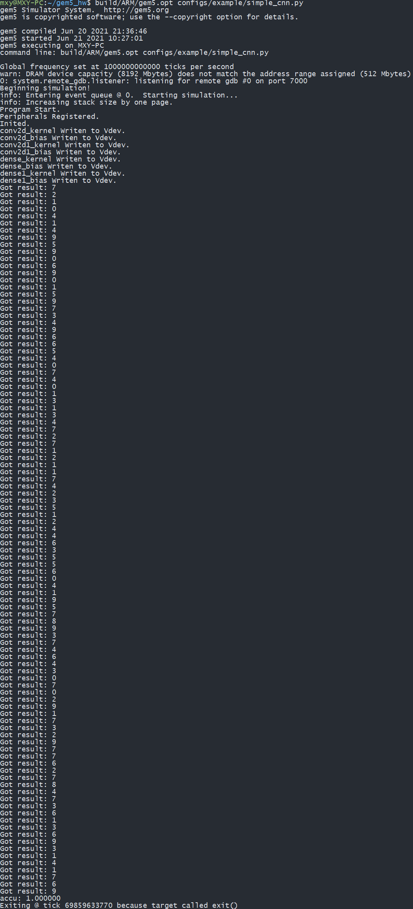
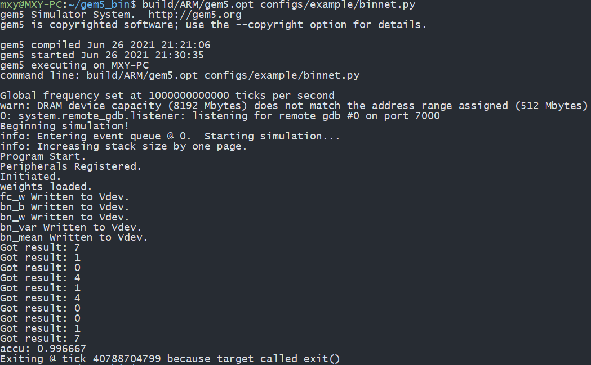
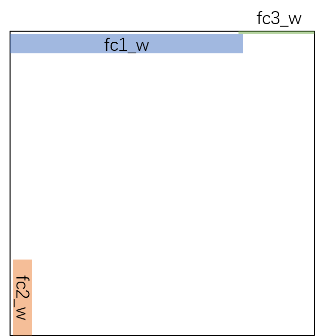

# 现代计算机体系架构大作业

## *——神经网络加速器仿真和优化*


## 提交代码结构

```
├─binnet_modified
│  ├─binnet
│  └─vdev
│      └─binnet
├─scripts
└─simplecnn_modified
```

其中`simplecnn_modified/`中提交了仿真神经网络加速器工程，包括：

- 修改后的`core.cpp`（替换`gem5/src/vdev/SimpleCNN/core.cpp`）

- 修改后的`main.c`（替换`gem5/tests/test-progs/simplecnn/main.c`）

- 修改的后的`simple_cnn.py`（替换`gem5/configs/example/simple_cnn.py`）


替换后重新编译仿真工程和测试程序。

`simple_cnn.py`添加了`--threshold`参数，可以使用`build/ARM/gem5.opt configs/example/simple_cnn.py --threshold 0.1`仿真阈值0.1的情形（具体可参见`-h`下的帮助）。


`binnet_modified/`中提交了仿真RRAM阵列工程，包括：

- 修改后的`gem5/src/vdev/`各文件，直接用`binnet_modified/vdev/`文件夹替换`gem5/src/vdev/`文件夹（`binnet_modified/vdev/binnet`文件夹下`memory.cpp`、`memory.h`、`memhub.cpp`、`memhub.h`、`tools.h`五个文件没有修改，但为了方便起见全部放入）
- 修改后的`gem5/tests/test-progs/`中的执行程序，直接把`binnet_modified/binnet/`放入`gem5/tests/test-progs/`目录下
- 修改后的`gem5/configs/example/`中的配置文件，直接把`binnet_modified/binnet.py`放入`gem5/configs/example/`目录下

替换后重新编译仿真工程和测试程序，使用`build/ARM/gem5.opt configs/example/binnet.py`仿真，路径已全部调整到和上述放置方法一致。

`binnet.py`添加了`--noise`参数和`--load_once`的flag（不添加则每次载入权重，添加则只载入一次），可以使用`build/ARM/gem5.opt configs/example/binnet.py --noise 0.5 --load_once`仿真RRAM噪声标准差0.5，权重只载入一次的情形（具体可参见`-h`下的帮助）。


`scripts/`中提交了实验中用以仿真与作图的各脚本，包括：

- `sim_threshold.sh`，用于神经网络加速器阈值、执行时间、权重中零的数目、准确度关系的仿真
- `sparsity_plot.py`，用于上述仿真的作图
- `visualize_cnn.py`，用于可视化神经网络的权重和特征
- `sim_noise.sh`，用于RRAM阵列噪声和准确度关系的仿真
- `rram_plot.py`，用于上述仿真的作图

这些脚本的使用可能需要人为调整日志和数据的路径。


## 1. 熟悉神经网络算法及仿真工程 

### 1.1 编译测试

编译仿真工程和`gem5/tests/test-progs/simplecnn/`中的测试程序后，运行`build/ARM/gem5.opt configs/example/simple_cnn.py`，对MNIST数据集中前100张图片达到100%的准确率，结果如下。



### 1.2 仿真工作原理

- 在`gem5/tests/test-progs/simplecnn/`下的代码中，`peripheral.c`和`peripheral.h`中的代码被用于与加速器硬件交互。加速器是以内存映射I/O的方式进行访问的，参见`gem5/src/vdev/vdev.cc`中，加速器硬件的具体实现中`Tick VirtualDevice::access(PacketPtr pkt)`函数，可以了解到加速器的内存映射存储空间中，有两个寄存器`pmem`和`counter`，地址偏置分别为0和1，此外还有三个存储器`mem1`、`mem2`和`mem3`。程序与加速器硬件进行交互，只需要向寄存器写入对应的操作控制字，并向存储器写入正确的数据，最终在中断发生时读取加速器计算的结果即可。

  具体地，`peripheral.c`和`peripheral.h`中定义了以下六个交互函数：

  - `void periRegister(int peri_id, uint8_t *reg_file)`函数，用于加载加速器，具体操作是对加速器的存储空间作内存地址映射。
  - `void periLogout(int peri_id)`函数，用于卸载加速器，具体操作是解除加速器的内存地址映射。
  - `void periInit(volatile uint8_t *cmd_reg, unsigned char counter)`函数，用于初始化加速器。将`counter`传入加速器，同时将`pmem`控制寄存器置为`VDEV_INIT`，并等待加速器初始化完毕。不同的`counter`对应于神经网络中的不同层，初始化操作可以用来将权重载入对应的位置（RRAM加速器），或其它准备操作。
  - `void periWrite(volatile uint8_t *cmd_reg, size_t offset, void *src, size_t len)`函数，用于将数据写入加速器，由于是内存映射，因此用户程序中只需要将数据写入对应的内存地址。
  - `void periRead(volatile uint8_t *cmd_reg, size_t offset, void *dest, size_t len)`函数，用于从加速器读出数据，同上，用户程序只需要读取对应的内存地址。
  - `bool periIsFinished(volatile uint8_t *cmd_reg)`函数，通过读取`pmem`寄存器，判断加速器是否运行完毕。

- 在`gem5/configs/example/simple_cnn.py`中，CPU与加速器的数据交换带宽被设置为了100MB/s，参见`system.vdev1.data_bandwidth = 10000`。该参数设置的是传输一个字节所需要的Tick数量，而由于gem5仿真每秒1000000000000个Tick，因此每秒能传输100000000个字节，即100MB/s。

- 加速器三个可与外部交换数据的存储器`mem1`、`mem2`和`mem3`对应的虚拟地址分别为0x3E800002、0x3E900002、0x3EA00002。这是在`gem5/configs/example/simple_cnn.py`的系统配置文件中`system.vaddr_vdev_ranges = [AddrRange('1000MB', '1010MB')]`定义，并且与`gem5/tests/test-progs/simplecnn/peripheral.h`中的`PERI_ADDR`数组定义相符合。也即，加速器的内存地址空间是从1000MB（0x3E800000）开始的10MB空间。而由前所述，参见`gem5/src/vdev/vdev.cc`中的`Tick VirtualDevice::access(PacketPtr pkt)`函数，前两个字节为`pmem`寄存器和`counter`寄存器。偏置不小于2，但小于`1024 * 1024 + 2`的地址为`mem1`，即`mem1`从0x3E800002开始；偏置不小于`1024 * 1024 + 2`，但小于`1024 * 1024 * 2 + 2`的地址为`mem2`，即`mem2`从0x3E900002开始；`mem3`从0x3EA00002开始。

- `gem5/src/vdev/SimpleCNN/simd.h`中，参见`struct Data`的定义，加速器处理数据时是以4个浮点数为一组进行计算的（同时参见`gem5/src/vdev/SimpleCNN/core.cpp`中可见，有64组运算单元并行）。


## 2. 稀疏神经网络的计算加速

### 2.1 神经网络的稀疏性

将神经网络权重值（略去偏置），以及以MNIST中的第一张图片为样例的各层特征作图如下所示。将图片缩小后可以很容易观察到，卷积层的权重颜色较全连接层更深，这表明全连接层有更多接近于0的值。这也可以从权重的均值与标准差得到。`conv2d_kernel`均值0.044333257，标准差0.16544187；`conv2d1_kernel`均值-0.0048159645，标准差0.09078268；`dense_kernel`均值-0.0008834979，标准差0.06243693；`dense1_kernel`均值0.0017155416，标准差0.08286497。无论均值还是标准差，全连接层都更小，这证明其具有更多接近0的值。具体地，第一个全连接层接近于0的数值最多，第一个卷积层最少。同时也可以看出，该网络特征的稀疏性比权重差很多，因此这里更多利用的是权重的稀疏性。


修改`main.c`，加入`sparsify()`函数，设定阈值，将权重数据写入加速器前，将绝对值小于一定阈值的权重改写为0，同时给`main()`函数加入参数，可以传入阈值。并且通过修改`gem5/configs/example/simple_cnn.py`，使得能够在仿真时传入`--threshold`参数。具体地，可以通过运行如`build/ARM/gem5.opt configs/example/simple_cnn.py --threshold 1e-2`仿真消除所有权重小于0.2的阈值的情形。

编写脚本`sim_threshold.sh`（其中还有与稀疏网络加速计算相关的部分），并且在`main.c`中输出各层权重的数量，将卷积层与全连接层运行时间分离导出。编写脚本`sparsity_plot.py`作图，精度与阈值大小之间结果如下，可以看到，阈值达到0.1后，精度开始大幅度下降。在阈值小于0.06时，可以保证在100张测试图片上全部正确。


### 2.2 稀疏网络的加速计算

修改`gem5/src/vdev/SimpleCNN/core.cpp`文件中的`Core::op_conv`函数和`Core::op_fc`函数，添加如下代码判断权重数据是否全为零，如果全零则跳过此轮运算，不消耗周期数。

```c++
bool flag_zero = true;
for (int i = 0; i < 4; i++)
{
	if (w.data[i] != 0)
	{
		flag_zero = false;
		break;
	}
}
if (flag_zero)
	continue;
```

仍然使用先前的脚本，仿真结果如下。

首先考察阈值与权重中零的个数的关系，全连接层与卷积层中零的个数随阈值上升曲线如下。总体权重数目全连接层远多于卷积层，但观察增长斜率的变化曲线可以看见，全连接层零的个数增长放缓，而卷积层一直稳步增加。可以证明，全连接层有更多接近零的权重。


阈值与卷积、全连接层的执行时间关系如下。可以看到，执行的绝大多数时间来源于卷积层。阈值提升时，卷积层执行时间稳步下降，阈值充分大时，全连接层几乎不消耗时间。同时，在阈值不超过0.06时，也几乎不减少时间。这也与先前所示的精度衰减相符，在阈值不超过0.06时，精度也几乎没有下降，也没有性能提升。总体上，卷积层减少的时间比例较全连接层小，这是因为卷积核中不常有连续的四个零，大部分权重都用以得到合理的特征，而全连接层中真正有意义的权重不多。即使如此，当全连接层执行时间变得很小时，精度迅速降低，这表明全连接层的权重虽然稀疏，但对正确预测也有着重要作用。


另一方面，作各层零的数量与运行时间的关系图。可以看到，卷积层的执行时间随着零的数量增长迅速降低。总体上是因为卷积层贡献了绝大多数计算，度过一开始一段时间，零的数量增长却没有连续的零可以跳过整段运算后，利用卷积层的稀疏性可以显著降低运行时间。而全连接层的运行时间（理应是一条逐步降低的平滑曲线，然而实际仿真中精度受限，有效数字较少，因此显示为折线）则是缓慢降低，对总的运行时间影响不大。


最后，可以观察将权重载入加速器所用的时间。可以看到这一段曲线和权重中总共零的数量非常接近，事实上二者也呈现线性关系。这一段加载的时间实际上对于神经网络加速器没有影响，因为权重可以直接在模型中修改，并且权重只需载入一次。这个线性关系主要在于目前的权重载入破坏了原本`fread`的整体读入，读入小于阈值的数需要向内存写入0，因此差异反映在了这些权重的写入指令数目之上。


## 3. CIM加速器的仿真实现

`binnet`程序模拟了在一个1024x1024大小的RRAM阵列上运行二值神经网络。对仿真工程以及程序进行修改，以实现对RRAM阵列的仿真。具体地，主要修改以下部分：

- 首先修改`binnet`程序，引入`peripheral.h`和`peripheral.c`替换`rram_array.h`。将原先主程序中的权重导入全部使用`peripheral.h`中的交互函数替代（参见1.2节）。与此同时，也要修改`Makefile`（使用`aarch64-linux-gnu-g++`，并且需要安装对应的交叉编译工具）。
- 使用`rram_array.h`替换`simd.h`中的加速器运算模块。
- 修改`core.h`和`core.cpp`中的运算模块。具体地，修改`op_init()`函数中的内存地址分配，使用`simd.h`中的`load_weight()`、`calculate()`和`sign()`函数实现`op_fc_calculate()`和`op_sign()`层，替换原有的`op_fc()`和`op_pool()`层。
- 修改`ai_chip.cpp`中的运行流程，使用`binnet`中的神经网络结构替代原先的CNN网络。并且需要在`class AIChip`类中添加一个`RRAM_Array`实例来仿真实际的RRAM阵列。
- 调整`vdev`、`configs`中各文件对应的路径。

这里需要注意的是，原先的CNN网络权重全部用浮点数来存储，如果仍然全部使用浮点数，那么3层1024x1024的权重矩阵就会占据$3\times1024\times1024\times4 = 12 \mathrm{MB}$的空间，超出给虚拟设备分配的10MB存储空间，更不论该存储空间还被划分为了三部分。因此权重矩阵使用`std::int8_t`类型存储，这导致使用时需要做强制类型转换，将`float*`指针转换为`std::int8_t*`指针，转换到二维的`std::int8_t[1024][1024]`矩阵时应该转换为`std::int8_t(*)[1024]`类型。并且在`core.cpp`的`op_init()`函数中分配地址时要注意计算数据长度，不重叠也不超出分配空间，否则会造成Page Fault或者数组越界访问，也要注意调整`ai_chip.h`中分配的空间，这对应的是host上分配的空间。

完成上述修改后，结果如下所示（这里跳过了大部分“Got result”输出，以使截图简洁）。




每次分类时都需要重新载入权重数据，可以调整权重数值在阵列上的存储位置，使得不必重新载入，减小这一overhead。该RRAM阵列是一个crossbar阵列，每层输入从1024列进入，进行MAC操作后从各行输出，进行Batch Normalization。要调整权重的位置，需要满足以下要求。

- 每层权重的行号（输出位置）应对应于相应Batch Normalization的权重位置，同时对应于网络下一层权重的列号（输入位置）。
- 各权重位置不能重叠，不论是全连接的权重或者是Batch Normalization的权重，后者表明，不同层全连接的权重不能出现在同一行上。
- 为方便起见，希望不调整整个网络输入位置（前784列）和输出位置（前10行），这样不用调整其它部分的代码，只需要调整权重放置位置。另一方面，虽然权重并非必须占据相邻的行列（只需占据若干行和若干列的交叉处），但方便起见，仍然把它们放在一个矩形之内。

由此设计如下方案。设置如下六个偏置量，分别为三层的权重的行、列起始位置偏置量。然后在读入数据时将它们拼成一个矩阵，如图所示。

```C++
int fc1_row_bias = 10, fc1_col_bias = 0;
int fc2_row_bias = 768, fc2_col_bias = fc1_row_bias;
int fc3_row_bias = 0, fc3_col_bias = fc2_row_bias;

...

for (int i = fc1_row_bias; i < fc1_row_bias + 64; i++)
{
	for (int j = fc1_col_bias; j < fc1_col_bias + 784; j++)
	{
		fscanf(fdata, "%hhd,", &fc_w[i][j]);
	}
}

for (int i = fc1_row_bias; i < fc1_row_bias + 64; i++)
{
	fscanf(fdata, "%f,", &bn_var[i]);
}

...
```



实际的代码中，为了兼容原先不合并权重矩阵的方案，保留了原先的读入。读入完毕后将所有权重拼在一起传入。然后修改`core.cpp`和`ai_chip.cpp`中的实现，添加一个变量记录是否已经传入了权重。这里要注意，要修改`vdev.cc`和`core.cpp`中的`ai_chip`构造函数，同时在`configs`中增加参数的定义。为方便起见，在主程序中只按是否有两个参数判定是否只载入一次权重。

分别使用以下两条指令仿真只载入一次权重和载入多次权重的情形。

```bash
build/ARM/gem5.opt configs/example/binnet.py --load_once
build/ARM/gem5.opt configs/example/binnet.py
```

这里前者的输出结果一致，同样为99.6667%的准确率，证明这种权重摆放方式的正确性，截图完全一致故略去。

二者的inference执行时间分别为2855μs和32791μs。可以看见，跳过载入可以节约绝大多数的时间。而且差距会随着inference次数增加而进一步增加。不过可以看见差距大约仅有10倍，不完全是权重载入的次数（900倍），表明其它部分的完成虽然周期数很少但不能忽略，主要是CPU和RRAM阵列的交互。

`tests`下有`diff-out`脚本，执行如下脚本（仅保留对应的一块stats文本），可以对比两次执行的日志，结果如下。

`./tests/diff-out m5out/stats_load_always.txt m5out/stats_load_once.txt`

```
Maximum error magnitude: +5801.497161%

                                  Reference  New Value   Abs Diff   Pct Chg
Key statistics:

  host_inst_rate                   24998732   11319842  -13678890   -54.72%
  host_mem_usage                     640480     640484          4    +0.00%
  sim_insts                        46059072   52012798    5953726   +12.93%
  sim_ops                          52822531   59242518    6419987   +12.15%
  sim_ticks                      2854677132 32791377132 29936700000  +1048.69%
  system.cpu.committedInsts          400072    6018822    5618750  +1404.43%
  system.cpu.committedOps            553122    6171872    5618750  +1015.82%

Differences > 0%:

  system.membus.pkt_count_system.cpu.dcache_port::system.vdev1.port      48425    2857800    2809375  +5801.50%
  system.cpu.num_conditional_control_insts      56812    2866187    2809375  +4945.04%
  system.cpu.Branches                 79805    2889180    2809375  +3520.30%
  system.cpu.num_load_insts           99560    2908935    2809375  +2821.79%
  system.cpu.op_class::MemRead    99560.000 2908935.000 2809375.000  +2821.79%
  system.membus.trans_dist::ReadReq     504701    8933426    8428725  +1670.04%
  system.cpu.committedInsts          400072    6018822    5618750  +1404.43%
  system.mem_ctrl.bytes_inst_read::cpu.inst    1600416   24075416   22475000  +1404.32%
  system.mem_ctrl.bytes_inst_read::total    1600416   24075416   22475000  +1404.32%
  system.mem_ctrl.bytes_read::cpu.inst    1600416   24075416   22475000  +1404.32%
  system.mem_ctrl.num_reads::cpu.inst     400104    6018854    5618750  +1404.32%
  system.membus.pkt_count_system.cpu.icache_port::system.mem_ctrl.port     800208   12037708   11237500  +1404.32%
  system.membus.pkt_count_system.cpu.icache_port::total     800208   12037708   11237500  +1404.32%
  system.membus.pkt_size_system.cpu.icache_port::system.mem_ctrl.port    1600416   24075416   22475000  +1404.32%
  system.membus.pkt_size_system.cpu.icache_port::total    1600416   24075416   22475000  +1404.32%
  system.membus.snoop_fanout::1  400104.000 6018854.000 5618750.000  +1404.32%
  system.membus.snoop_fanout::samples     629342    9058050    8428708  +1339.29%
  system.membus.snoop_fanout::total     629342    9058050    8428708  +1339.29%
  system.cpu.num_mem_refs            220793    3030168    2809375  +1272.40%
  system.membus.snoop_fanout::0  229238.000 3039196.000 2809958.000  +1225.78%
[... showing top 20 errors only, additional errors omitted ...]
```

可以看到，二者主要的差别在于对RRAM阵列的存储访问。虽然载入权重是虚拟设备内部完成的工作，但是对于主CPU来说，它一直在等待`pmem`上`VDEV_READY`信号，进行忙等。其一直在访问`pmem`地址，因此总线上可以看到对`vdev`的访问数目是区别最多的，其次是忙等相应的分支指令数。值得注意的是，这里虽然对RRAM阵列的存储访问数目区别是最大的，但是最终的执行时间差距没有这么大的差距。这表明主要瓶颈在于总线带宽之上，造成单次访问时间差异较大，而非访问延时上。

原先猜测由于有中断时间限制（`VirtualDevice.py`中的`delay_cpu_interrupt`为1ms），因此总线带宽不成为主要瓶颈，单次访问所需要的时间几乎由中断时间决定。但实际上，该参数被`configs`中的`system.vdev1.delay_cpu_interrupt = '1000t'`所覆盖，因此单个中断只占用1000个Tick，即1ns，不构成主要限制。因此实际上的瓶颈在于载入输入的带宽，总共需要传输$784\times 300=235\mathrm{KB}$，用时2350μs，基本是只载入一次权重时的主要消耗来源。另一方面，每个样本载入权重3次，每次100000个周期，主频3GHz，即占用100μs，300个样本即30000μs，基本是两种模式的时间差异。这表明只载入一次权重时，载入输入成为主要瓶颈，而多次载入时主要瓶颈在载入时间。


实际的RRAM在使用过程中，每次从阵列内读出的权重值不会是完美的+1或-1，而是会有一定的随机误差。为仿真这一误差，将`simd.h`中的权重矩阵改为`float`类型，并在权重载入的`load_weight()`函数中添加随机噪声，这种方式比较符合实际情形，即在权重写入时电阻阻值存在偏差。在`class RRAM_Array`中添加一个随机数发生器实例（以及对应的随即设备和引擎），并修改`ai_chip`的构造函数，在`VirtualDevice.py`、`configs`和主程序中添加噪声参数。

这里值得注意的是，有噪声RRAM阻值的分布可以用对数正态分布近似[^1]。虽然文献中对RRAM阻值的噪声既有用正态分布又有用对数正态分布近似的，但考虑到最终的阻值应该全部为正，不应出现负值，使用其它的噪声分布如正态分布会使得阻值出现负数，而对数正态不会出现这一问题，因此这里采用对数正态分布。对数正态分布要从对数值的均值和方差换算为原变量的均值和方差，参见如下公式。
$$
\mu =\ln(\mathrm {E} (X))-{\frac {1}{2}}\ln \left(1+{\frac {\mathrm {var} (X)}{\mathrm {E} (X)^{2}}}\right) \\
\sigma ^{2}=\ln \left(1+{\frac {\mathrm {var} (X)}{\mathrm {E} (X)^{2}}}\right)
$$
在代码中参数直接传入标准差，`dist(-log(1 + stddev * stddev) / 2.0, sqrt(log(1 + stddev * stddev)))`可以构造均值为1，标准差为`stddev`的阻值分布。

编写`sim_noise.sh`脚本仿真和`rram_plot.py`脚本作图，结果如下。可以看到，当标准差非常大时（与均值可比），才开始影响精度，在标准差达到5倍均值或更高时精度才显著开始下降。这表明二值化的神经网络抗干扰能力较强，这也符合常识。另一方面，可以看到权重只载入一次时，由于噪声永久保存，在每一次的inference时都一致，因此随机性较大，精度反复波动（这里精度并未按照多次实验取平均值），而多次载入权重，噪声则每次不同，可以相互抵消，准确度较为稳定，但总体二者趋势几乎一致。


[^1]: J. Reuben, M. Biglari and D. Fey, "Incorporating Variability of Resistive RAM in Circuit Simulations Using the Stanford–PKU Model," in IEEE Transactions on Nanotechnology, vol. 19, pp. 508-518, 2020, doi: 10.1109/TNANO.2020.3004666.

