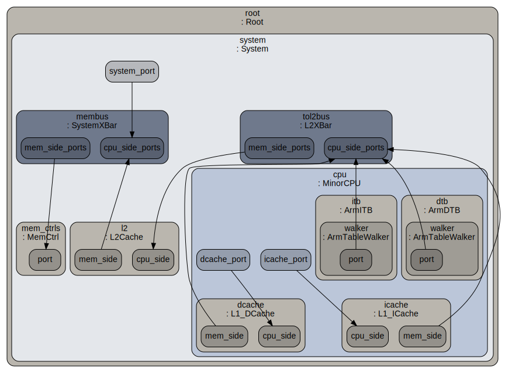
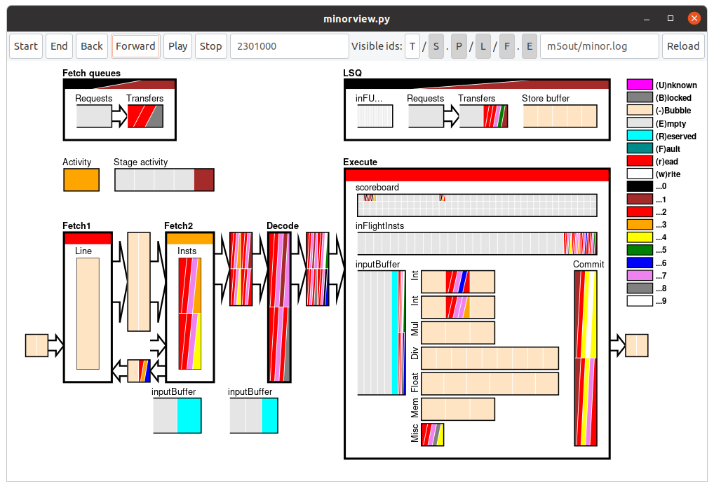
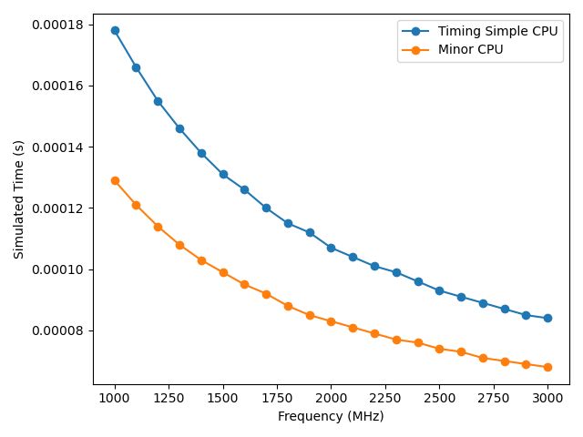

# 现代计算机体系架构第一次课程实验

## *——基于gem5仿真器的单核流水线处理器仿真*


## 1. gem5的安装与测试

### 1.1 安装gem5

下载源码并在源码目录执行`scons build/ARM/gem5.debug`即可编译ARM指令集架构。

### 1.2 编译ARM指令集架构SE模式下的处理器仿真程序并测试

SE模式下执行hello world测试程序：

`build/ARM/gem5.debug configs/example/se.py -c tests/test-progs/hello/bin/arm/linux/hello`

结果如下所示。

```
**** REAL SIMULATION ****
info: Entering event queue @ 0.  Starting simulation...
Hello world!
Exiting @ tick 2916500 because exiting with last active thread context
Simulated exit code not 0! Exit code is 13
```


## 2. 交叉编译

### 2.1 交叉编译器的安装使用

使用ARM指令集交叉编译器编译八皇后问题c程序文件：

`aarch64-linux-gnu-gcc -o queens queens.c --static`

得到ARM架构下的可执行程序`queens`，在ARM仿真平台上运行，默认皇后个数为8，仿真参数如下表。

| Parameter            | Value | Parameter          | Value |
| :------------------- | ----- | :----------------- | :---- |
| CPU-type             | minor | L1 data cache size | 8kB   |
| L1 instr. cache size | 8kB   | L1 cache assoc     | 4     |
| L2 cache size        | 1MB   | L2 cache assoc     | 8     |
| Cache line size      | 64B   | Clock              | 1GHz  |
| CPU number           | 1     |                    |       |

如下设置各仿真参数，注意通过`--caches`启用缓存，`--l2cache`启用L2缓存。

```bash
build/ARM/gem5.debug configs/example/se.py \
--num-cpus=1 \
--caches \
--l2cache \
--l1d_size=8kB \
--l1i_size=8kB \
--l2_size=1MB \
--l1d_assoc=4 \
--l1i_assoc=4 \
--l2_assoc=8 \
--cacheline_size=64 \
--cpu-type=MinorCPU \
--cpu-clock=1GHz \
--cmd=tests/test-progs/queens/queens
```

结果如下所示。

```
**** REAL SIMULATION ****
info: Entering event queue @ 0.  Starting simulation...
info: Increasing stack size by one page.
warn: ignoring syscall mprotect(...)
8 queens on a 8x8 board...
 Q - - - - - - -
 - - - - Q - - -
 - - - - - - - Q
 - - - - - Q - -
 - - Q - - - - -
 - - - - - - Q -
 - Q - - - - - -
 - - - Q - - - -
Exiting @ tick 128903000 because exiting with last active thread context
```

可通过`m5out`中输出的`config.dot`检查处理器的架构正确配置（例如没有缺少L2缓存）。



### 2.2 仿真程序的参数设置

通过`-o`或`--options`参数传递仿真程序的参数。由`queens.c`的说明，可以传递皇后数量作为参数。具体地，以`queens [-ac] n`调用，可以求解n皇后问题，并且可调用`-a`参数求指定皇后数对应的所有解，而`-c`参数则隐藏所有解的具体形式，只计数解的个数。因此仿真中使用`-o`可以传递`queens`的参数，例如如下求解六皇后问题的所有解（执行`queens -a 6`）：

```bash
build/ARM/gem5.debug configs/example/se.py \
--num-cpus=1 \
--caches \
--l2cache \
--l1d_size=8kB \
--l1i_size=8kB \
--l2_size=1MB \
--l1d_assoc=4 \
--l1i_assoc=4 \
--l2_assoc=8 \
--cacheline_size=64 \
--cpu-type=MinorCPU \
--cpu-clock=1GHz \
--cmd=tests/test-progs/queens/queens \
--options="-a 6"
```

结果如下所示，六皇后问题共四个解。

```
**** REAL SIMULATION ****
info: Entering event queue @ 0.  Starting simulation...
info: Increasing stack size by one page.
warn: ignoring syscall mprotect(...)
6 queens on a 6x6 board...

Solution #1:
 - Q - - - -
 - - - Q - -
 - - - - - Q
 Q - - - - -
 - - Q - - -
 - - - - Q -

Solution #2:
 - - Q - - -
 - - - - - Q
 - Q - - - -
 - - - - Q -
 Q - - - - -
 - - - Q - -

Solution #3:
 - - - Q - -
 Q - - - - -
 - - - - Q -
 - Q - - - -
 - - - - - Q
 - - Q - - -

Solution #4:
 - - - - Q -
 - - Q - - -
 Q - - - - -
 - - - - - Q
 - - - Q - -
 - Q - - - -

...there are 4 solutions
Exiting @ tick 173554000 because exiting with last active thread context
```

### 2.3 交叉编译的目的

交叉编译在当前架构的平台上编译其它架构的可执行程序，其目的在于生成对应架构的处理器仿真能够运行的可执行程序。因为gem5仿真平台的SE模式下并没有完整的操作系统与编译环境，因此需要通过交叉编译生成仿真使用的可执行程序。

### 2.4 搭建交叉编译器

由于gem5对于MIPS的支持并不充分，因此在使用预编译的MIPS交叉编译器（如Ubuntu中的`gcc-mipsel-linux-gnu`）会出现各种问题。首先，gem5仅支持小端法的MIPS，因此需要安装小端法的交叉编译器（mipsel中的el即代表小端法，区别于`gcc-mips-linux-gnu`这一大端法的交叉编译器）。其次，gem5没有实现MIPS中的Prefetch类型指令（如`pref`和`prefx`指令），因此在使用预编译的交叉编译器时，静态链接库文件时，可能会使得可执行程序中包含Prefetch指令，造成仿真出错。

例如使用`gcc-mipsel-linux-gnu`进行编译：

`mipsel-linux-gnu-gcc -o queens-mips queens.c --static`

再进行无参数的MIPS仿真（gem5的MIPS不支持MinorCPU，因此这里略过仿真参数），添加调试参数观察出错原因，`--debug-flags`选取`Exec`查看仿真执行的所有指令。

`build/MIPS/gem5.debug --debug-file=debug.o --debug-flags=Exec configs/example/se.py --cmd=tests/test-progs/queens/queens-mips`

结果如下所示，实际没有报错，但程序没有正确执行，原因在于Prefetch没有实现。

```
**** REAL SIMULATION ****
info: Entering event queue @ 0.  Starting simulation...
info: Increasing stack size by one page.
warn: Prefetching not implemented for MIPS
warn: 1157500: Halting thread 0 in system.cpu @ PC 422a90, setting restart PC to 422a94
Exiting @ tick 18446744073709551615 because simulate() limit reached
```

查找`debug.o`中调试所得执行的各指令，找到不支持的`pref`指令，来源是`memcpy`系统调用。

```
❯ cat m5out/debug.o | grep "pref"
 299500: system.cpu: T0 : @memcpy+264    : pref       r4, 0(r5)       : IntAlu :
```

之的注意的是，查看`debug.o`可发现，这条指令并非仿真执行的最后一条指令，因为该指令（对cache的提示）在仿真中没有具体实现，在仿真中被直接忽略，造成运行结果出错，但程序本身未直接在此停止。实际上，也可以自行在gem5中实现该条指令。这里选择使用更通用、可配置的交叉编译器来解决这一问题。

Crosstool-NG是一个通用的交叉编译链生成器，且高度可配置。可以参见[Crosstool-NG文档](https://crosstool-ng.github.io/docs/)进行操作。首先下载其源码并进行编译安装。随后可以通过`ct-ng list-samples`考察生成交叉编译器的样例配置文件，这里选择以`mips-unknown-linux-uclibc`为模板生成交叉编译器（`mipsel-unknown-linux-gnu`使用gnu库，同上会出现Prefetch指令，因此选择uclibc），执行`ct-ng mips-unknown-linux-uclibc`使用此模板。调用`ct-ng menuconfig`可以修改配置，这里主要注意要改为小端法。配置完成后执行`ct-ng build`即可编译安装，将安装路径添加到`PATH`环境变量即可使用交叉编译器。

从而调用`mipsel-unknown-linux-uclibc-gcc -o queens-mips queens.c --static`，即可交叉编译MIPS平台下的可执行程序`queens-mips`。进行仿真：`build/MIPS/gem5.debug configs/example/se.py --cmd=tests/test-progs/queens/queens-mips`（忽略所有参数，仅验证交叉编译的正确性），结果如下所示。

```
**** REAL SIMULATION ****
info: Entering event queue @ 0.  Starting simulation...
info: Increasing stack size by one page.
8 queens on a 8x8 board...
 Q - - - - - - -
 - - - - Q - - -
 - - - - - - - Q
 - - - - - Q - -
 - - Q - - - - -
 - - - - - - Q -
 - Q - - - - - -
 - - - Q - - - -
warn: 23117500: Halting thread 0 in system.cpu @ PC 401118, setting restart PC to 40111c
Exiting @ tick 18446744073709551615 because simulate() limit reached
```

这表明搭建的交叉编译器是正确的。


## 3. 流水线处理器的性能分析

### 3.1 Minor流水线结构

执行如下仿真并使用调试参数，输出trace文件`minor.log`，trace文件记录的起始和结束tick设为0和10000000（即前10μs，程序总共执行129μs），仿真参数与先前一致。

```bash
build/ARM/gem5.debug \
--debug-flags=MinorTrace \
--debug-start=0 \
--debug-end=10000000 \
--debug-file=minor.log \
configs/example/se.py \
--num-cpus=1 \
--caches \
--l2cache \
--l1d_size=8kB \
--l1i_size=8kB \
--l2_size=1MB \
--l1d_assoc=4 \
--l1i_assoc=4 \
--l2_assoc=8 \
--cacheline_size=64 \
--cpu-type=MinorCPU \
--cpu-clock=1GHz \
--cmd=tests/test-progs/queens/queens
```

执行`./util/minorview.py ./m5out/minor.log`可打开流水线的可视化，如下所示。



Minor处理器共有四级流水，每一级的名称和作用如下表所示。

| Stage Number | 名称            | 功能                                                     |
| ------------ | --------------- | -------------------------------------------------------- |
| 1            | 取指1（Fetch1） | 从指令缓存中取部分或完整的缓存行，并传递至Fetch2。       |
| 2            | 取指2（Fetch2） | 从Fetch1获取缓存行，将其分解为若干条指令，传递至Decode。 |
| 3            | 译码（Decode）  | 将指令译码，分解为微指令。                               |
| 4            | 执行（Execute） | 执行指令。                                               |

Execute Stage包含以下模块：

- Functional Units：各运算单元，均为FIFO的队列，图示的处理器含有两个整型运算单元、一个整型乘法器、一个整型除法器、一个浮点运算单元、一个存储单元、一个MISC单元（用于Instruction Prefetch和IPR Access，IPR即Interrupt Priority Register），（实际还有一个预测单元，具体参见`MinorDefaultFUPool`中的配置）。这一部分中，除去各运算单元本身外，还有辅助指令的执行操作的其它模块。指令在执行过程中遇到三种操作：发射、前进、提交。其中指令在运算单元中前进，而针对发射和提交有如下模块：
  - Input Buffer：输入缓冲区，在各Functional Units前存储指令，准备发射到各运算单元。
  - Commit：提交模块，将`inFlightInsts`队列队头的指令提交。

- Scoreboard：用于控制指令发射，计数当前在执行的写入各个寄存器的指令数量，发射后目标寄存器对应的项增加1，指令提交后目标寄存器对应的项减1，仅在计数为0时发射指令，消除冒险。
- `Execute::inFlightInsts`队列：以正确顺序存储所有正在执行的指令，发射时进入队列，提交时离开队列。
- `LSQ`队列：用于处理load/store指令，所有此类指令被发送到这个模块进行执行。该模块具有三个主要的FIFO队列：Requests、Transfers和Store Buffer。
  - Requests队列：存储所有已送到TLB还未收到回复的load/store请求。
  - Transfers队列：存储所有已发射还未受到回复的load/store请求。
  - Store Buffer：存储所有已提交还仍未写入存储器的请求。

Stage间的forward FIFO即相当于流水线的级间寄存器，存储前一级的结果，只是有可能具有多条信息排队，各时钟周期开始时取队头进入下一级；backward FIFO仅限于Fetch1和Fetch2级间，用于传递分支预测的信息，根据Fetch2预测发挥的信息，Fetch1可能跳转到新的PC地址或者暂停取指。

### 3.2 处理器频率-性能特性

使用脚本`sim_freq.sh`遍历1GHz至3GHz的频率仿真，并将结果中的运行时间提取，同时为了能够方便分析，一并将`stats.txt`重命名储存。核心代码如下所示，完整代码见`sim_freq.sh`。

```bash
cp m5out/stats.txt $Root/stats_${CPUtype}_$i$Unit.txt
SimSeconds=`grep 'sim_seconds' m5out/stats.txt | tr -s ' ' | cut -d ' ' -f 2`
echo $i $SimSeconds >> $Log
```

这里脚本中的`CPUtype`变量需要手动编辑以仿真相应的CPU类型，需要分别设为`MinorCPU`与`TimingSimpleCPU`并运行脚本以仿真两种CPU。同时编写`sim_freq_plot.py`脚本进行作图，结果如下所示。



随着频率增长，处理器运行时间减少，但减少的趋势变缓。从1GHz到3GHz，Timing Simple CPU运行时间从178μs减少到84μs，减少52.8%；Minor CPU运行时间从129μs减少到68μs，减少47.3%。运行时间减少趋势变缓，主要在于除CPU外，系统其它部分（L2 Cache与主存）性能未能跟上，cache miss造成的延时对应的周期数增大。观察Minor CPU的`stats.txt`可发现，用`systems.cpu.numCycles`减`systems.cpu.idleCycles`的值，即CPU处在运行状态的周期数大致不变，但CPU处在空闲等待的周期数不断增加，应是在等待数据，这也造成CPI增加，使得性能提升不如时钟频率的提升。另外，观察两种CPU的`stats.txt`也发现，各级缓存对应的`overall_miss_latency`不断增加，符合推测。

而对于两种处理器模型，Timing Simple CPU的性能随频率上升提升更多，因为提升频率主要提升非访存指令的性能，而Timing Simple CPU中，非访存指令所花时间较Minor CPU占比更大（Minor CPU瓶颈主要在于访存，而对非访存指令并行执行，效率较高）。因此由Amdahl定律，Timing Simple CPU的性能随频率上升提升更多。

### 3.3 处理器功能单元特性

参考如下八皇后问题仿真时的指令类型统计，可以发现指令几乎均为整型运算与整型的读写，几乎没有浮点运算。因此针对八皇后问题应该选择优化整数运算单元。

```
system.cpu.op_class_0::No_OpClass                   9      0.02%      0.02% # Class of committed instruction
system.cpu.op_class_0::IntAlu                   27739     64.09%     64.11% # Class of committed instruction
system.cpu.op_class_0::IntMult                      7      0.02%     64.12% # Class of committed instruction
system.cpu.op_class_0::IntDiv                       3      0.01%     64.13% # Class of committed instruction
system.cpu.op_class_0::FloatAdd                     0      0.00%     64.13% # Class of committed instruction
system.cpu.op_class_0::FloatCmp                     0      0.00%     64.13% # Class of committed instruction
system.cpu.op_class_0::FloatCvt                     0      0.00%     64.13% # Class of committed instruction
system.cpu.op_class_0::FloatMult                    0      0.00%     64.13% # Class of committed instruction
system.cpu.op_class_0::FloatMultAcc                 0      0.00%     64.13% # Class of committed instruction
system.cpu.op_class_0::FloatDiv                     0      0.00%     64.13% # Class of committed instruction
system.cpu.op_class_0::FloatMisc                    0      0.00%     64.13% # Class of committed instruction
system.cpu.op_class_0::FloatSqrt                    0      0.00%     64.13% # Class of committed instruction
system.cpu.op_class_0::SimdAdd                     28      0.06%     64.19% # Class of committed instruction
system.cpu.op_class_0::SimdAddAcc                   0      0.00%     64.19% # Class of committed instruction
system.cpu.op_class_0::SimdAlu                     35      0.08%     64.28% # Class of committed instruction
system.cpu.op_class_0::SimdCmp                     36      0.08%     64.36% # Class of committed instruction
system.cpu.op_class_0::SimdCvt                      0      0.00%     64.36% # Class of committed instruction
system.cpu.op_class_0::SimdMisc                    27      0.06%     64.42% # Class of committed instruction
system.cpu.op_class_0::SimdMult                     0      0.00%     64.42% # Class of committed instruction
system.cpu.op_class_0::SimdMultAcc                  0      0.00%     64.42% # Class of committed instruction
system.cpu.op_class_0::SimdShift                    0      0.00%     64.42% # Class of committed instruction
system.cpu.op_class_0::SimdShiftAcc                 0      0.00%     64.42% # Class of committed instruction
system.cpu.op_class_0::SimdDiv                      0      0.00%     64.42% # Class of committed instruction
system.cpu.op_class_0::SimdSqrt                     0      0.00%     64.42% # Class of committed instruction
system.cpu.op_class_0::SimdFloatAdd                 0      0.00%     64.42% # Class of committed instruction
system.cpu.op_class_0::SimdFloatAlu                 0      0.00%     64.42% # Class of committed instruction
system.cpu.op_class_0::SimdFloatCmp                 0      0.00%     64.42% # Class of committed instruction
system.cpu.op_class_0::SimdFloatCvt                 0      0.00%     64.42% # Class of committed instruction
system.cpu.op_class_0::SimdFloatDiv                 0      0.00%     64.42% # Class of committed instruction
system.cpu.op_class_0::SimdFloatMisc                0      0.00%     64.42% # Class of committed instruction
system.cpu.op_class_0::SimdFloatMult                0      0.00%     64.42% # Class of committed instruction
system.cpu.op_class_0::SimdFloatMultAcc             0      0.00%     64.42% # Class of committed instruction
system.cpu.op_class_0::SimdFloatSqrt                0      0.00%     64.42% # Class of committed instruction
system.cpu.op_class_0::SimdReduceAdd                0      0.00%     64.42% # Class of committed instruction
system.cpu.op_class_0::SimdReduceAlu                0      0.00%     64.42% # Class of committed instruction
system.cpu.op_class_0::SimdReduceCmp                0      0.00%     64.42% # Class of committed instruction
system.cpu.op_class_0::SimdFloatReduceAdd            0      0.00%     64.42% # Class of committed instruction
system.cpu.op_class_0::SimdFloatReduceCmp            0      0.00%     64.42% # Class of committed instruction
system.cpu.op_class_0::SimdAes                      0      0.00%     64.42% # Class of committed instruction
system.cpu.op_class_0::SimdAesMix                   0      0.00%     64.42% # Class of committed instruction
system.cpu.op_class_0::SimdSha1Hash                 0      0.00%     64.42% # Class of committed instruction
system.cpu.op_class_0::SimdSha1Hash2                0      0.00%     64.42% # Class of committed instruction
system.cpu.op_class_0::SimdSha256Hash               0      0.00%     64.42% # Class of committed instruction
system.cpu.op_class_0::SimdSha256Hash2              0      0.00%     64.42% # Class of committed instruction
system.cpu.op_class_0::SimdShaSigma2                0      0.00%     64.42% # Class of committed instruction
system.cpu.op_class_0::SimdShaSigma3                0      0.00%     64.42% # Class of committed instruction
system.cpu.op_class_0::SimdPredAlu                  0      0.00%     64.42% # Class of committed instruction
system.cpu.op_class_0::MemRead                   9860     22.78%     87.20% # Class of committed instruction
system.cpu.op_class_0::MemWrite                  5540     12.80%    100.00% # Class of committed instruction
system.cpu.op_class_0::FloatMemRead                 0      0.00%    100.00% # Class of committed instruction
system.cpu.op_class_0::FloatMemWrite                0      0.00%    100.00% # Class of committed instruction
system.cpu.op_class_0::IprAccess                    0      0.00%    100.00% # Class of committed instruction
system.cpu.op_class_0::InstPrefetch                 0      0.00%    100.00% # Class of committed instruction
system.cpu.op_class_0::total                    43284                       # Class of committed instructions
```

对此进行验证，将Minor CPU配置文件`src/cpu/minor/MinorCPU.py`中的`MinorDefaultFloatSimdFU`（浮点运算单元）的延时`opLat`由6改为3（周期数）模拟优化浮点运算单元，而再将`MinorDefaultIntFU`（整数运算单元）的延时`opLat`由3改为2，分别进行编译仿真（重新编译`scons build/ARM/gem5.debug`）。这里整数运算单元的提升不足一倍，且未提升`MinorDefaultIntMulFU`整型乘法器和`MinorDefaultIntDivFU`整型除法器，若在此种情况下，优化整数运算单元的处理器性能已经超过了优化浮点运算单元的，则证明针对八皇后问题，优化整数运算单元更有效。

修改浮点运算单元的延时后，在1GHz的Minor CPU上（参数同前），运行时间由129μs减少到128μs。而修改整数运算单元的延时后，在同样的参数下，运行时间由129μs减少到126μs。由于对整数运算单元优化幅度不如浮点运算单元，却提升更大，可以证明优化整数运算单元更有效。

